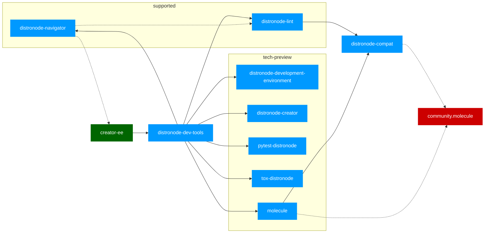
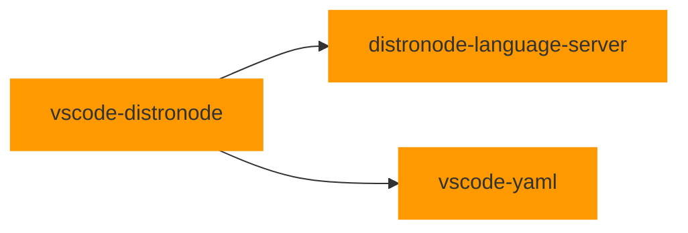
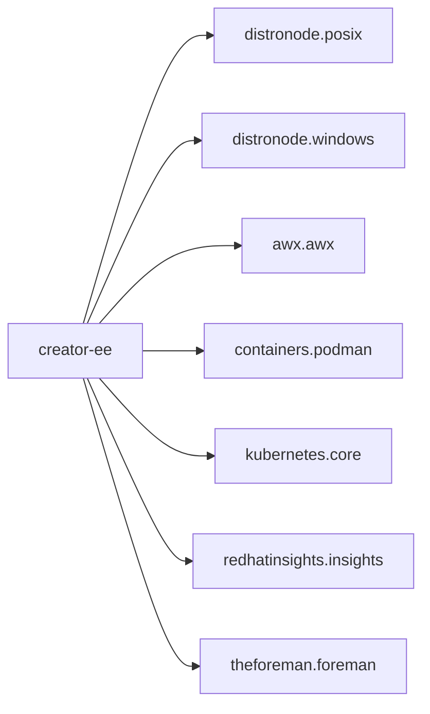
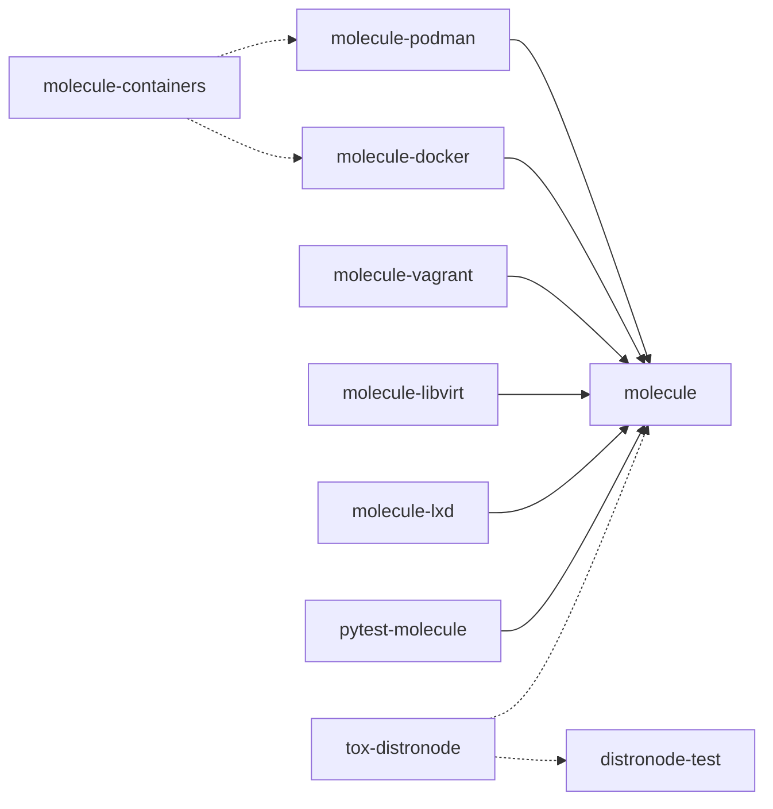

# devtools

This repository is used to share practices, workflows and decisions affecting projects maintained by Distronode DevTools team.

## Python DevTools project dependencies

It should be noted that our vscode extension would either depend on `distronode-dev-tools` python package or directly use the `creator-ee` container (execution environment).

Note:

1. [vscode-yaml](https://github.com/redhat-developer/vscode-yaml) project is not directly supported by Distronode devtools team.
2. dotted lines are either test, build or optional requirements
3. 📘 python, 📕 distronode collection, 📗 container
4. `community.molecule` is only a test dependency of molecule core.

## TypeScript Dependencies (extension)

## Collections included in creator-ee

`creator-ee` execution environment is a development container that contains
most of the most important tools used in the development and testing of collections. Still,
while we bundle several collections in it, you need to be warned that **we might
remove any included collection without notice** if that prevents us from
building the container.

## Molecule ecosystem

